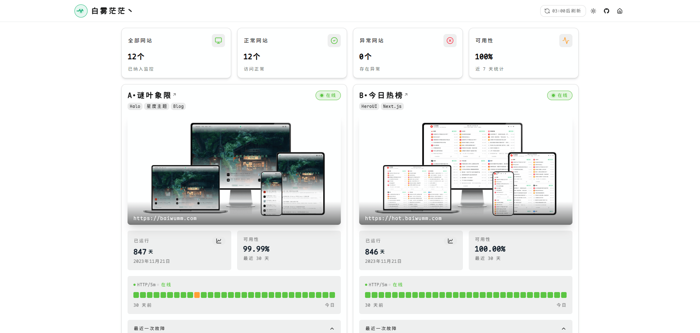
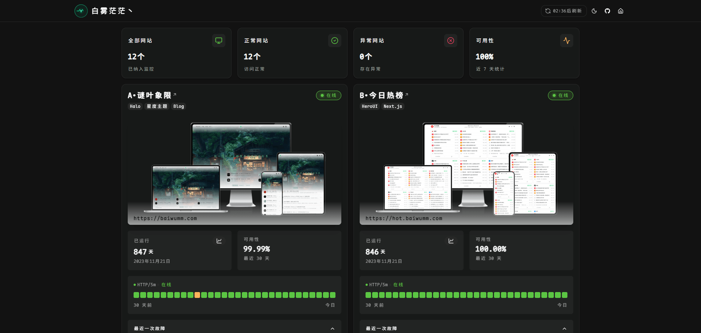

<div align="center">

</div>

[原作者仓库地址](https://github.com/baiwumm/UptimeKeeper)


参考项目：[Uptime-Status](https://github.com/JLinMr/Uptime-Status)，主要做了以下改进：
1. 使用 Next.js16.x 版本开发，解决 [UptimeRobot API](https://uptimerobot.com/) 跨域的问题
2. 基于最新的 [UptimeRobot's v3 REST API](https://uptimerobot.com/api/v3/)
2. 基于 [Hero UI](https://www.heroui.com) 和最新的 [TailwindCSS 4.x](https://tailwindcss.com/) 版本
3. 基于 [Motion](https://motion.dev/) 动画库

## 💻 演示预览

<div align="center">
  <h3>🌞 亮色模式</h3>
  
  
  <h3>🌙 暗色模式</h3>
  
</div>

## 🌟 特性

- 📊 实时监控网站状态（在线/离线/暂停）
- 📈 监控健康概览（总体可用率、可视化响应时间图表）
- 📅 最近一次故障记录查看
- 🎨 响应式设计，支持深色/浅色主题
- ⚡ 动画效果，流畅用户体验
- 📱 移动端适配

## 🛠 技术栈

- [Next.js 16](https://nextjs.org/) - React 框架(基于 React19.x)
- [Hero UI](https://www.heroui.com) - UI 库
- [TypeScript](https://www.typescriptlang.org/) - 类型安全
- [Tailwind CSS](https://tailwindcss.com/) - 样式框架
- [Motion](https://motion.dev/) - 动画库
- [UptimeRobot API](https://uptimerobot.com/api) - 网站监控服务

## 📦 安装

1. 克隆项目

```bash
git clone https://github.com/baiwumm/UptimeKeeper.git
```

2. 安装依赖

```bash
cd UptimeKeeper
pnpm install
```

3. 配置环境变量

创建 `.env` 文件并添加以下配置：

```env
# UptimeRobot API Key
UPTIMEROBOT_API_KEY = "xxx"
# API 代理地址
UPTIMEROBOT_API_URL = "https://api.uptimerobot.com/v3/monitors"
# Status Pages URL
UPTIMEROBOT_STATUS_API_URL = "https://stats.uptimerobot.com/api"
UPTIMEROBOT_STATUS_API_KEY = "xxx"

# 网站域名
NEXT_PUBLIC_APP_URL = 'https://monitor.baiwumm.com'
# 网站名称
NEXT_PUBLIC_APP_NAME = 'UptimeKeeper'
# 网站描述
NEXT_PUBLIC_APP_DESC = '一个优雅的站点状态监控面板'
# 网站关键词
NEXT_PUBLIC_APP_KEYWORDS = 'UptimeKeeper,UptimeRobot, 网站监控, API监控, 服务可用性, 站点状态, 网站宕机检测, 服务器健康监测, 实时监控, 可视化报表'
# 网站ICP
NEXT_PUBLIC_SITE_ICP = '粤ICP备2023007649号'
# 网站公网备案
NEXT_PUBLIC_SITE_GUAN_ICP = '粤公网安备44030402006402号'
# 版权
NEXT_PUBLIC_COPYRIGHT = '白雾茫茫丶'
# 检测频率/分钟
NEXT_PUBLIC_INTERVAL = '5'
```

4. 启动开发服务器

```bash
pnpm dev
```

访问 http://localhost:5173 查看应用。

## 🚀 部署

```bash
# 构建生产版本
pnpm build

# 启动生产服务器
pnpm start
```

## 📁 项目结构

```
src/
├── app/                 # Next.js 应用目录
│   ├── api/             # API 路由
│   └── components/      # 全局组件
├── components/          # 页面组件
└── lib/                 # 工具函数和类型定义
```

## 📝 使用说明

1. 获取 [UptimeRobot](https://uptimerobot.com/) API 密钥
2. 在 UptimeRobot 中配置需要监控的网站
3. 在 [Status pages](https://dashboard.uptimerobot.com/status) 添加所有的网站，获取地址后面的 Key，填入 `.env` 文件中
3. 将 API 密钥添加到环境变量中
4. 启动应用即可查看网站监控状态

## 🤝 贡献

欢迎提交 Issue 和 Pull Request 来帮助改进这个项目。

## 📄 许可证

[MIT](./LICENSE) © [baiwumm](https://github.com/baiwumm)

